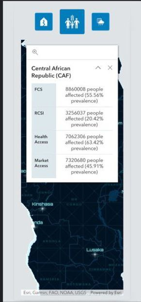
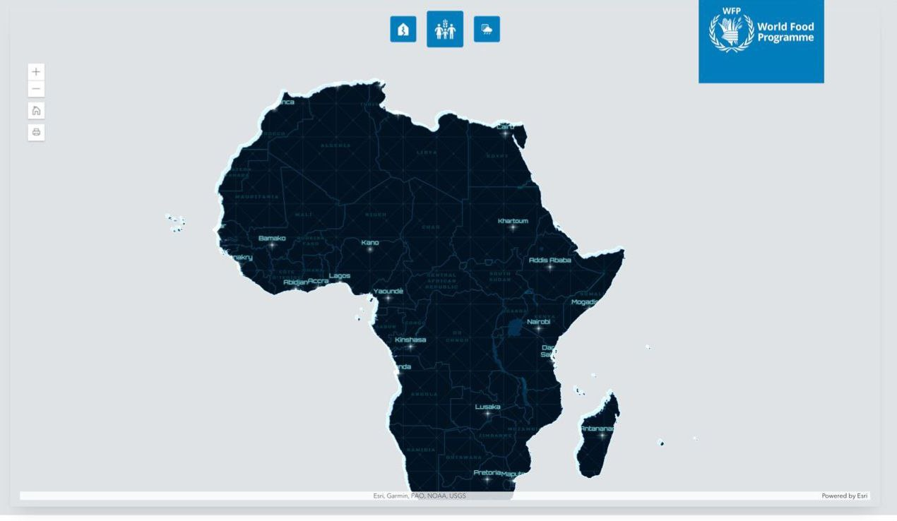
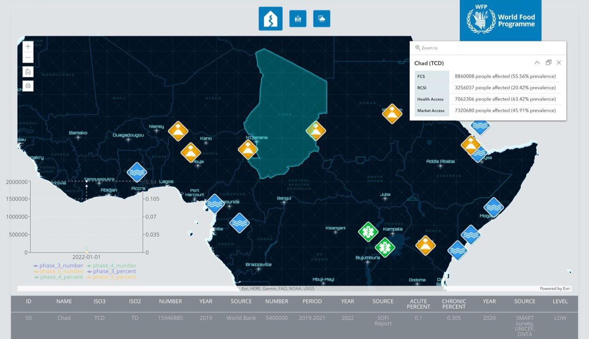
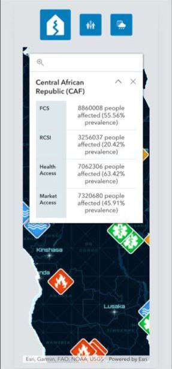
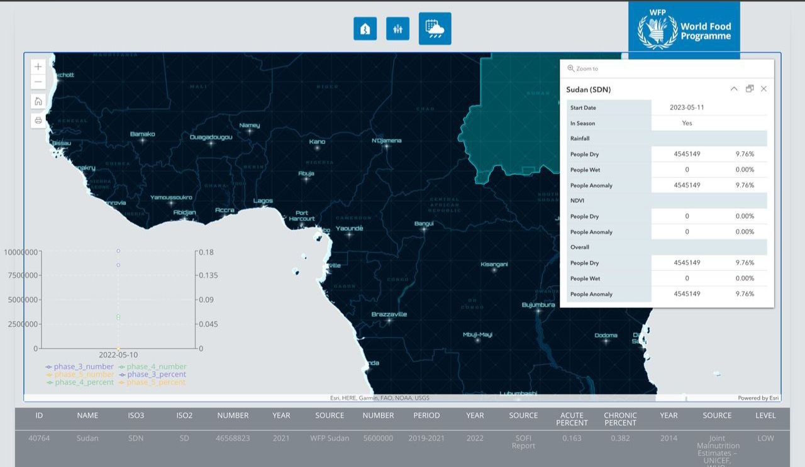

# WFP Hunger Map Monitoring 

## Overview

This is a React, Typescript-based application for monitoring the evolution of food insecurity levels. The application uses ESRI, Redux Toolkit (RTK), ReachRTS and WFP UI to develop a map-based interface with informative features and insights.

The application is built as a response to a set of tasks: Design, Development, and Deployment. For more details about these tasks, please refer to the Tasks section below.

### Features

- Map-based interface for monitoring food insecurity levels
- Utilization of various data sources for comprehensive insights
- Reactivity and responsiveness for different screen sizes (tablet and mobile)
- (Add more features as required)

## Tasks

### TASK 1: DESIGN

Output: UX/UI design deliverables. The UX/UI design deliverables include (mention the design deliverables here). Please find the design assets in the (mention the location of the assets - could be a link to a folder in the repository or a live URL).







### TASK 2: DEVELOPMENT

Output: This GitHub repository contains all the code developed for the assignment. The application uses React JS and Redux Toolkit (RTK) for development and ESRI for the geographical component. 

Data sources utilized in the development include:

- Country information API: [Country information](https://api.hungermapdata.org/v2/info/country)
- Integrated Food Security Phase Classification (IPC) API: [IPC](https://api.hungermapdata.org/v1/ipc/peaks)
- Food Consumption Score (FCS) and Reduced Coping Strategy Index (rCSI) API: [FCS & rCSI](https://api.hungermapdata.org/v1/foodsecurity/country/<ISO3_CODE>)
- Climate stats data API: [Climate stats](https://api.hungermapdata.org/v2/climate/country)
- Hazards data API: [Hazards](https://api.hungermapdata.org/v1/climate/hazards)
- Shape files: (Provide link or location to the Shape files)

### TASK 3: DEPLOYMENT

The application is deployed and live hosted at (http://wfptask.s3-website.eu-north-1.amazonaws.com/).

## Getting Started

### Prerequisites

- Node.js
- NPM

### Installation

1. Clone the repository
    ```
    git clone git@github.com:guest922/WFPHungerMap.git
    ```

2. Install NPM packages
    ```
    npm install
    ```

3. Start the development server
    ```
    npm start
    ```
